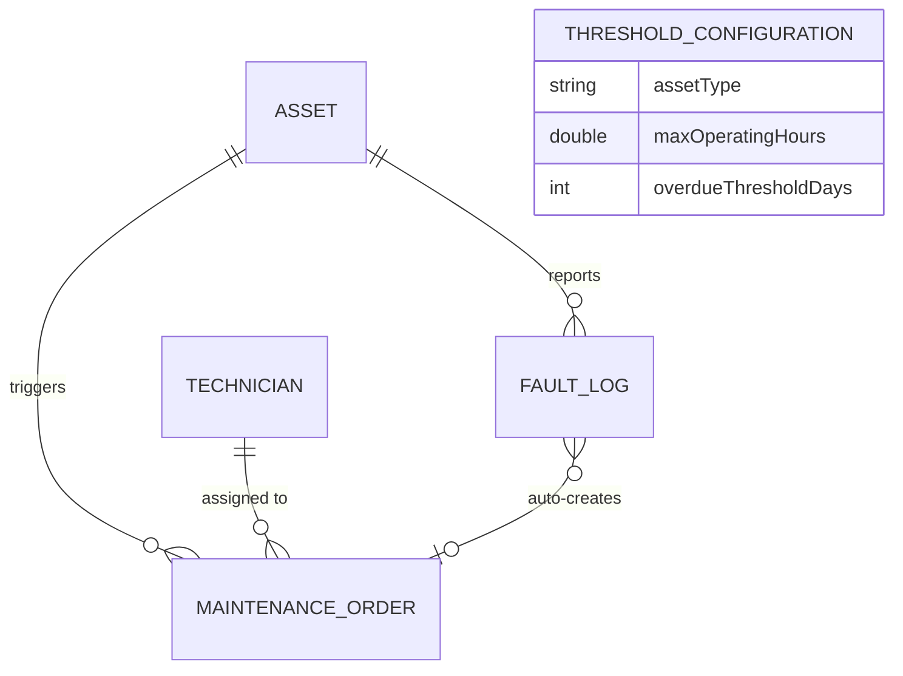

# Fleet Maintenance Platform

[](https://github.com/mdmazing/fleet-maintenance-platform/actions/workflows/ci.yml)

A production-oriented REST API for managing industrial fleet assets, maintenance workflows, fault tracking, and technician assignments.

Built as a portfolio project to demonstrate backend engineering practices: layered architecture, database migrations, business-rule-driven scheduling, integration testing, and containerisation.

---

## Tech Stack

| Layer | Technology |
|---|---|
| Language | Java 21 |
| Framework | Spring Boot 3.3 |
| Persistence | PostgreSQL 16, Spring Data JPA, Hibernate |
| Migrations | Flyway 10 |
| API Docs | Springdoc OpenAPI 3 / Swagger UI |
| Testing | JUnit 5, Testcontainers, MockMvc |
| Containerisation | Docker, Docker Compose |
| CI | GitHub Actions |

---

## Domain Overview

The platform models a maintenance operation for industrial equipment (vehicles, cranes, compressors, generators, pumps). Three mechanisms automatically trigger a `MaintenanceOrder` without manual intervention:

| Trigger | Condition |
|---|---|
| **Hours exceeded** | Asset operating hours pass the configured threshold for its type |
| **Overdue schedule** | `nextMaintenanceDue` date has passed and no open order exists |
| **Fault escalation** | A `HIGH` or `CRITICAL` fault is reported — an order is created immediately |

---

## Architecture



### Package structure

```
src/main/java/com/fleet/maintenance/
├── domain/          # JPA entities and enums
├── repository/      # Spring Data JPA interfaces
├── service/         # Business logic and MaintenanceScheduler
├── controller/      # REST endpoints
├── dto/             # Request and response objects
└── exception/       # GlobalExceptionHandler, custom exceptions
```

### Maintenance order lifecycle

```
PENDING -> ASSIGNED -> IN_PROGRESS -> COMPLETED
                                   -> CANCELLED
```

---

## Getting Started

### Prerequisites

- Java 21+
- Docker and Docker Compose

### 1 — Start the database

```bash
docker compose up -d postgres
```

The container starts PostgreSQL 16 on host port `5433` (avoids conflicts with any local PostgreSQL installation on 5432). Flyway runs all five migrations automatically on first startup.

### 2 — Start the application

```bash
# Windows
.\mvnw.cmd spring-boot:run

# Linux / macOS
mvn spring-boot:run
```

### 3 — Explore the API

| URL | Description |
|---|---|
| http://localhost:8080/swagger-ui.html | Interactive Swagger UI |
| http://localhost:8080/api-docs | Raw OpenAPI 3 JSON |
| http://localhost:8080/actuator/health | Health check |
| http://localhost:8080/actuator/metrics | Application metrics |

---

## API Overview

### Assets — /api/assets

| Method | Path | Description |
|---|---|---|
| POST | /api/assets | Register a new asset |
| GET | /api/assets | List all assets |
| GET | /api/assets/{id} | Get asset by ID |
| GET | /api/assets/status/{status} | Filter by status |
| GET | /api/assets/overdue | Assets past their maintenance due date |
| PUT | /api/assets/{id} | Update location, status, and maintenance dates |
| PATCH | /api/assets/{id}/operating-hours | Update operating hours |
| DELETE | /api/assets/{id} | Delete an asset |

### Maintenance Orders — /api/maintenance-orders

| Method | Path | Description |
|---|---|---|
| POST | /api/maintenance-orders | Create an order manually |
| GET | /api/maintenance-orders | List all orders |
| GET | /api/maintenance-orders/{id} | Get order by ID |
| GET | /api/maintenance-orders/status/{status} | Filter by lifecycle status |
| GET | /api/maintenance-orders/asset/{assetId} | All orders for an asset |
| PUT | /api/maintenance-orders/{id}/status | Advance or cancel an order |
| DELETE | /api/maintenance-orders/{id} | Delete an order |

### Technicians — /api/technicians

| Method | Path | Description |
|---|---|---|
| POST | /api/technicians | Register a technician |
| GET | /api/technicians | List all technicians |
| GET | /api/technicians/{id} | Get by ID |
| PUT | /api/technicians/{id} | Update details |
| PUT | /api/technicians/{id}/availability/{available} | Toggle availability |
| DELETE | /api/technicians/{id} | Delete |

### Fault Logs — /api/fault-logs

| Method | Path | Description |
|---|---|---|
| POST | /api/fault-logs | Report a fault |
| GET | /api/fault-logs | List all fault logs |
| GET | /api/fault-logs/unresolved | Open (unresolved) faults |
| GET | /api/fault-logs/severity/{severity} | Filter by severity |
| GET | /api/fault-logs/asset/{assetId} | Faults for an asset |
| PUT | /api/fault-logs/{id}/resolve | Mark a fault as resolved |
| DELETE | /api/fault-logs/{id} | Delete |

---

## Example Workflow

```bash
# 1. Register an asset
curl -X POST http://localhost:8080/api/assets \
  -H "Content-Type: application/json" \
  -d '{"serialNumber":"VAN-001","type":"VEHICLE","location":"Friedrichshafen","operatingHours":450}'

# 2. Register a technician
curl -X POST http://localhost:8080/api/technicians \
  -H "Content-Type: application/json" \
  -d '{"employeeNumber":"TECH-001","firstName":"Max","lastName":"Mueller","email":"m.mueller@example.com","specialization":"Fleet Maintenance"}'

# 3. Report a critical fault — a maintenance order is created automatically
curl -X POST http://localhost:8080/api/fault-logs \
  -H "Content-Type: application/json" \
  -d '{"assetId":1,"reportedBy":"Operator","severity":"CRITICAL","description":"Brake failure detected"}'

# 4. Assign the order to a technician and start work
curl -X PUT http://localhost:8080/api/maintenance-orders/1/status \
  -H "Content-Type: application/json" \
  -d '{"status":"IN_PROGRESS","technicianId":1,"notes":"Brake system inspection started"}'

# 5. Complete the order — asset status flips back to OPERATIONAL automatically
curl -X PUT http://localhost:8080/api/maintenance-orders/1/status \
  -H "Content-Type: application/json" \
  -d '{"status":"COMPLETED","notes":"Brake pads replaced"}'
```

---

## Configuration

| Property | Default | Description |
|---|---|---|
| DB_USERNAME | fleet | PostgreSQL username (env var) |
| DB_PASSWORD | fleet | PostgreSQL password (env var) |
| fleet.scheduler.check-interval-ms | 300000 | Scheduler check interval in ms |

Threshold values (max operating hours per asset type) are seeded by Flyway migration V3 and can be updated directly in the `threshold_configurations` table.

---

## Running Tests

Integration tests use **Testcontainers** — a real PostgreSQL container is started per test run. Docker must be running.

```bash
# Windows
.\mvnw.cmd verify

# Linux / macOS
mvn verify
```

The test suite covers:

- Asset CRUD including duplicate serial number rejection (409 Conflict)
- Maintenance order lifecycle transitions (PENDING to IN_PROGRESS to COMPLETED)
- Asset status automatically reset to OPERATIONAL on order completion
- Fault log creation with automatic order escalation for HIGH/CRITICAL severity
- Fault resolve workflow

---

## CI/CD

GitHub Actions runs on every push to `main` and `develop`, and on pull requests targeting `main`.

Pipeline steps:

1. Checkout source and set up JDK 21 (Eclipse Temurin)
2. `mvn verify` — compiles and runs all integration tests via Testcontainers
3. `docker build` — validates the production image builds (main branch pushes only)

---

## Design Decisions

**Flyway over ddl-auto: create** — Schema changes are version-controlled SQL scripts. `ddl-auto: validate` then ensures the schema and entities stay in sync at startup.

**Testcontainers over H2** — Tests run against the same PostgreSQL engine used in production. H2 compatibility quirks have historically masked real-database issues in schema-sensitive code.

**spring.jpa.open-in-view: false** — Keeping the Hibernate session open for the full HTTP lifecycle is an anti-pattern that encourages lazy-loading outside transaction boundaries. All data access is resolved within `@Transactional` service methods.

**Duplicate-order guard in the scheduler** — Before auto-creating an order, the scheduler checks whether an open order already exists for the asset. This prevents duplicate orders when the scheduler fires while an asset is already under maintenance.

---

## What This Project Demonstrates

- Layered Spring Boot architecture (controller, service, repository)
- JPA entity relationships with proper transaction management
- Flyway database migrations with seed data
- Business logic driven by domain events (fault severity triggers orders)
- Scheduled background processing with idempotency guard
- Structured error responses with appropriate HTTP status codes (400, 404, 409, 500)
- Integration testing with Testcontainers against a real database
- Containerised development environment with Docker Compose
- GitHub Actions CI pipeline

---

## Potential Improvements

- Spring Security with JWT and role-based access (technician vs. admin)
- Pagination and sorting on list endpoints
- Notification service (email or webhook) on CRITICAL fault escalation
- Audit logging with Hibernate Envers
- Metrics export to Prometheus and Grafana

---

## License

MIT
